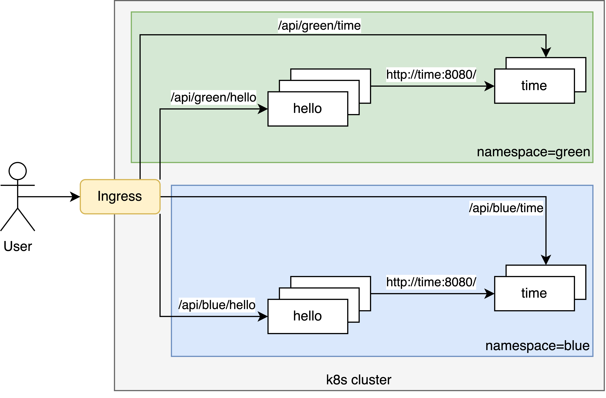

# k8s

## Requirements

* java 21
* docker
* minikube (`brew install minikube`)
* kubectl (included in minikube)
* istioctl (`brew install istioctl`)
* helm (`brew install helm`)

## Components



## Deploy

### Reset Minikube

```bash
minikube delete
minikube start --cpus=8 --memory=8G
minikube addons enable metrics-server
istioctl install -y
```

### Build Services

```bash
(
  cd _deploy
  eval $(minikube docker-env)
  ./build-images.sh
)
```

### Deploy Services

```bash
(
  cd _deploy
  ./deploy-services.sh
)
```

### Tunnel to Host

```bash
minikube tunnel
```

### Check

```bash
open http://localhost/api/green/main
```

### Dashboard

```bash
minikube dashboard
```

### Switch Default Namespace

```bash
(
  cd _deploy
  ./switch-default-namespace.sh ${COLOR:-green}
)
```
